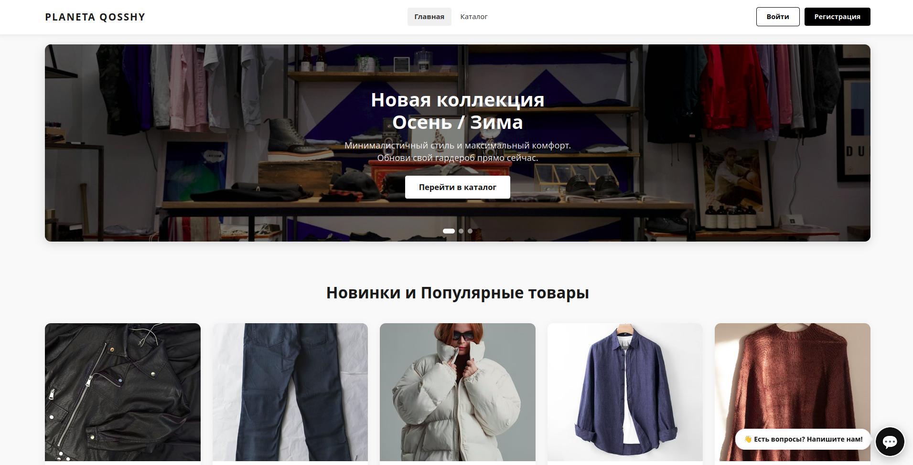
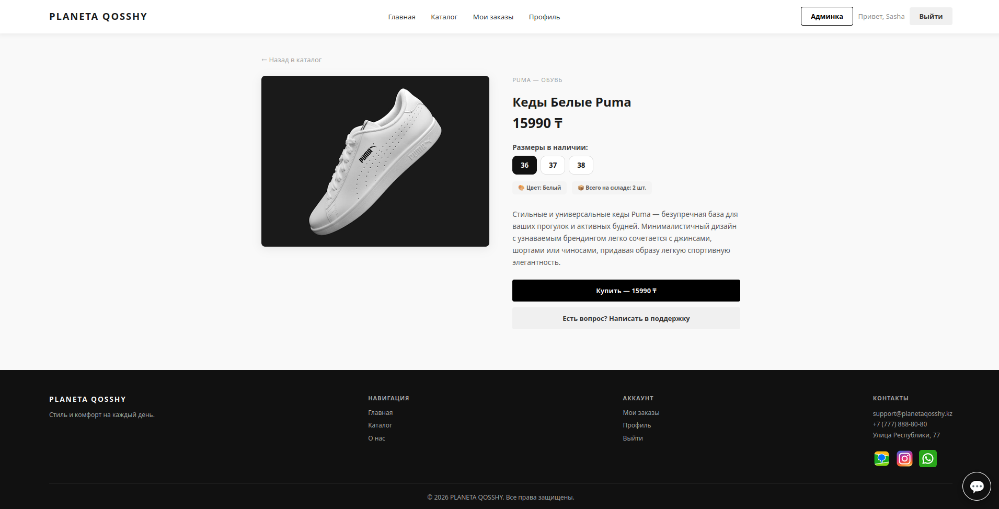
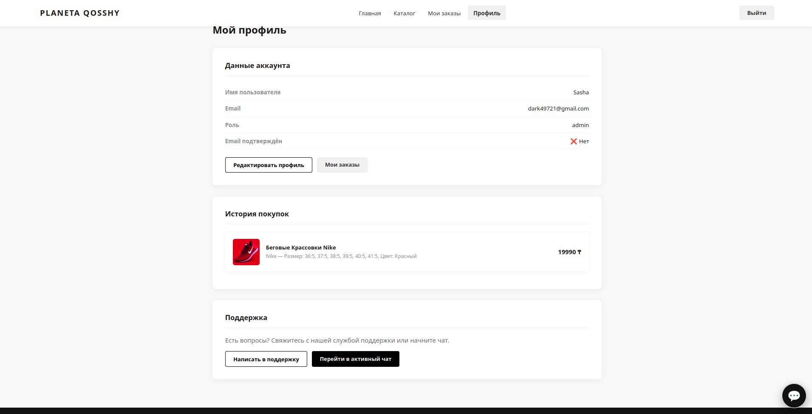
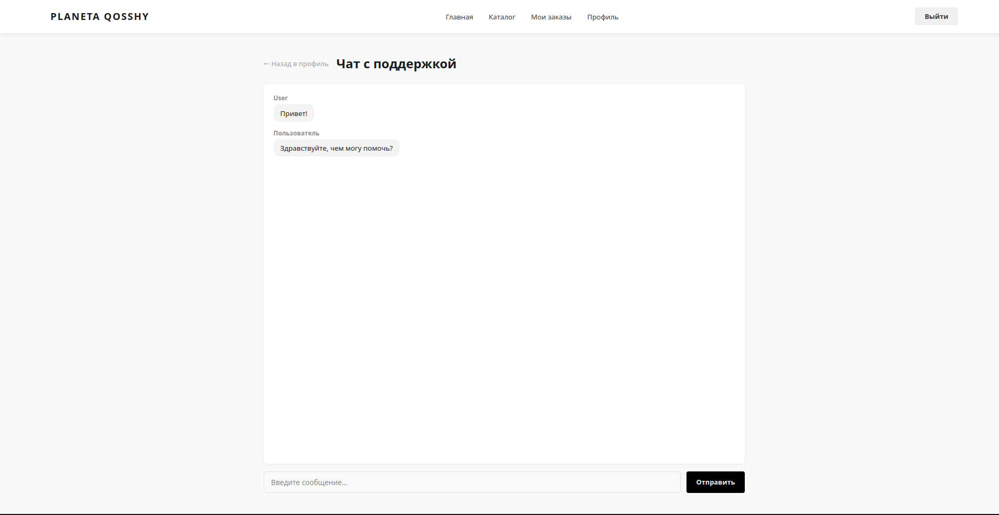
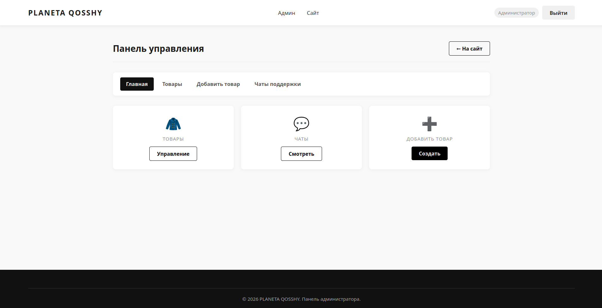
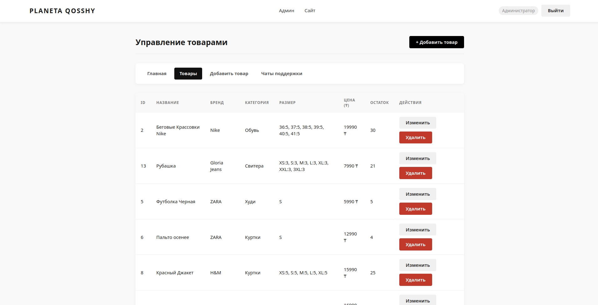
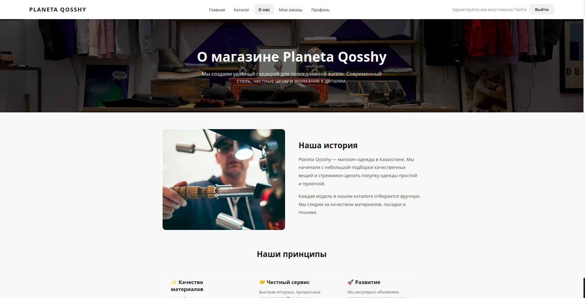
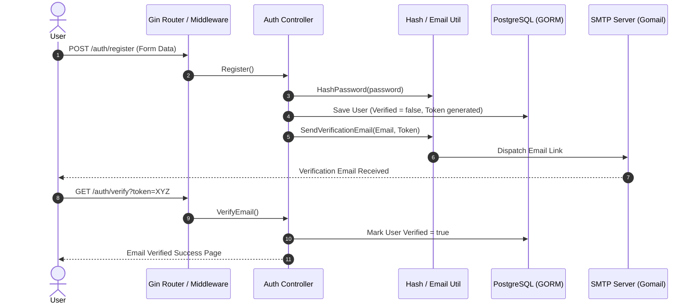
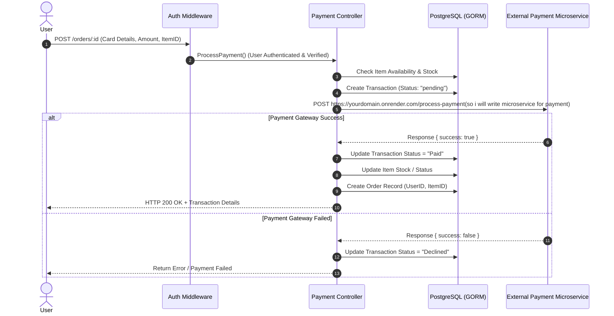
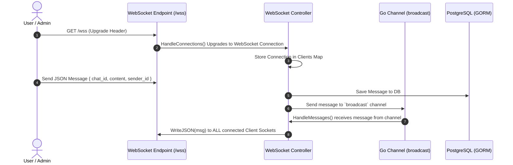

# 👕 Planeta Qosshy — Clothes Selling Services Platform

**Planeta Qosshy** is a full-stack e-commerce web application built in **Go (Golang)** using the **Gin Web Framework**, **GORM ORM**, **PostgreSQL**, **Gorilla WebSockets**, and **Gorilla Sessions**. 

The platform supports user authentication with email verification, clothes catalog browsing with detailed item views, order processing, external payment gateway integration, real-time live support chat via WebSockets, email helpdesk support, user profile management, and a comprehensive admin dashboard.

---

## 🖼 UI Preview / Скриншоты интерфейса

### 🛍 1. Витрина и Карточка товара
<p align="center">
  
  
</p>

### 👤 2. Профиль пользователя и Онлайн-чат поддержки
<p align="center">
  
  
</p>

### ⚙️ 3. Панель Администратора
<p align="center">
  
  
</p>

### ℹ️ 4. О компании
<p align="center">
  
</p>

---

## 📐 Architecture & Technology Stack

| Layer / Aspect | Technology / Library | Description |
| :--- | :--- | :--- |
| **Language** | Go 1.25 | Core backend server |
| **Web Framework** | [Gin Gonic](https://github.com/gin-gonic/gin) | HTTP router, request handling, HTML template rendering |
| **Database & ORM** | [GORM](https://gorm.io/) + PostgreSQL | Object-Relational Mapping & PostgreSQL database persistence |
| **Session Management** | [Gorilla Sessions](https://github.com/gorilla/sessions) | Cookie-backed user session storage |
| **Real-time WebSockets** | [Gorilla WebSocket](https://github.com/gorilla/websocket) | Bidirectional communication for live support chat |
| **Email Service** | [Gomail v2](https://gopkg.in/gomail.v2) | Transactional emails (Email Verification, Helpdesk) |
| **Containerization** | Docker & Docker Compose | Containerized Go API + PostgreSQL database |
| **Security & Auth** | `golang.org/x/crypto/bcrypt` | Password hashing & comparison |
| **Rate Limiting** | `golang.org/x/time/rate` | Middleware rate-limiting against DDoS/abuse |
| **Logging** | [Logrus](https://github.com/sirupsen/logrus) | Structured logging to stdout and `server.log` |
| **Testing** | `testify`, `go test`, Selenium (Python) | Unit, Integration, and E2E browser testing |

---

## 📦 Package Structure & Responsibilities

The codebase is structured following standard MVC and layered architecture principles:

```text
Planeta_Qosshy/
├── main.go                     # Entry point: DB connection, logger setup, routing, HTTP server startup
├── Dockerfile                  # Multi-stage Dockerfile for Go API
├── docker-compose.yml          # Container configuration for PostgreSQL + Go API
├── .env                        # Environment variables (Database URL, SMTP credentials, etc.)
├── images/                     # Screenshot images and project UI assets
├── controllers/                # Request handlers and business logic
│   ├── admin_chat_controller.go# Admin chat ticket management & reply actions
│   ├── admin_controller.go     # Admin dashboard & clothes CRUD operations
│   ├── auth_controller.go      # Registration, login, logout, & email verification
│   ├── clothes_controller.go   # Public catalog viewing & item details
│   ├── email_controller.go     # Helpdesk support contact form
│   ├── order_controller.go     # User order history lookup
│   ├── payment_controller.go   # Checkout, payment processing & external gateway API integration
│   ├── user_controller.go      # User profile retrieval and updates
│   ├── websocket_controller.go # Live chat WS connection handling & message broadcasting
│   └── SQLcontrollerTEMPORARY.go# Admin raw SQL query execution utility
├── database/                   # Database configuration
│   └── db.go                   # PostgreSQL connection initialization, retry loop & auto-migrations
├── middleware/                 # HTTP Pipeline Middlewares
│   ├── admin.go                # Admin role authorization check (`RequireAdmin`)
│   ├── auth.go                 # Session authentication & email verification check (`AuthRequired`)
│   ├── logger.go / logging.go  # Custom request & server loggers using Logrus
│   ├── rateLimit.go            # Request rate limiter middleware
│   └── session.go             # CookieStore initialization
├── models/                     # GORM Database Models / Entities
│   ├── chat.go                 # Support chat session entity
│   ├── clothes.go              # Clothes item entity (Title, Description, Category, Price, Stock, ImageURL)
│   ├── message.go              # Support message entity
│   ├── order.go                # Customer order record entity
│   ├── payment.go              # Payment attempt record entity
│   ├── transaction.go          # Transaction state & gateway response record entity
│   └── user.go                 # User account entity (Username, Password, Role, VerificationToken)
├── routes/                     # Application routing definitions
│   └── routes.go               # Gin router setup, route groups, template function maps
├── templates/                  # Server-side HTML templates rendered by Gin
├── util/                       # Utility and helper functions
│   ├── email.go                # Gomail email dispatcher (Verification links, support emails)
│   ├── hash_password.go        # Bcrypt password hashing and verification
│   └── validation.go           # Data validation helpers
└── tests/                      # Automated test suite
    ├── UNIT_hashPassword_test.go       # Unit test for bcrypt hashing
    ├── INTEGRATION_admin_new_car_test.go# Integration test for admin item creation
    └── E2E_selenium_test.py            # Python Selenium E2E automated test script
```

---

## 🔄 Data Flows & Workflows

### 1. User Registration & Authentication Flow



### 2. Purchase & External Payment Processing Flow



### 3. Real-Time WebSocket Support Chat Flow



---

## 🐳 Running with Docker & Docker Compose (Recommended)

You can launch both the **Go API** and the **PostgreSQL** database in isolated containers with a single command.

### Step-by-Step Docker Setup

1. **Start the containers**:
   ```bash
   docker compose up --build -d
   ```

2. **Check container status**:
   ```bash
   docker compose ps
   ```

3. **View application logs**:
   ```bash
   docker compose logs -f api
   ```

4. **Stop the environment**:
   ```bash
   docker compose down -v
   ```

---

## ⚙️ Environment Variables Setup (Local Execution)

If running directly on host without Docker, create a `.env` file in `Planeta_Qosshy/`:

```ini
# Server Port
PORT=8080

# PostgreSQL Connection String
DATABASE_URL="host=localhost port=5432 user=postgres password=postgrespassword dbname=clothesSell sslmode=disable"

# SMTP Configuration for Email Verification & Helpdesk
SMTP_HOST=smtp.gmail.com
SMTP_USER=your_email
SMTP_PASS=your_password
SMTP_PORT=587
VERIFICATION_ADDRESS=http://localhost:8080
```

---

## 🚀 Running Locally (Without Docker)

1. **Navigate to the application directory**:
   ```bash
   cd Planeta_Qosshy
   ```
2. **Install dependencies**:
   ```bash
   go mod download
   ```
3. **Run application**:
   ```bash
   go run main.go
   ```

---

## 🧪 Testing

- **Run Go Unit & Integration Tests**:
  ```bash
  go test ./tests/... -v
  ```

- **Run E2E Selenium Test**:
  ```bash
  python3 tests/E2E_selenium_test.py
  ```
